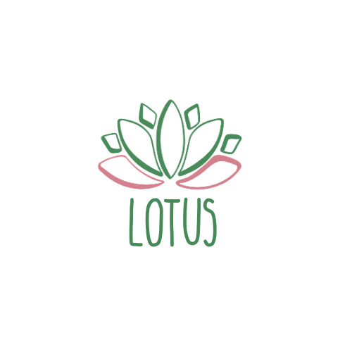

# Lotus Tech - Transformando a saúde com visão e propósito

## 💼 Sobre Nós

A **Lotus Tech** é uma equipe interdisciplinar dedicada a criar soluções tecnológicas para desafios reais na área da saúde. Nossa missão é desenvolver ferramentas inteligentes, acessíveis e escaláveis, com impacto direto na vida dos pacientes e na eficiência dos profissionais.

## Parcerias

## 👥 Colaboradores

<a href="https://github.com/Malice112" target="_blank" style="text-align: center; margin-right: 10px;">

Maria Alice Freitas Araújo RM557516

</a>

<a href="https://github.com/jaoAprendiz" target="_blank" style="text-align: center; margin-right: 10px;">

João Victor Soave - RM 557595

</a>

<a href="https://github.com/KStiliano" target="_blank" style="text-align: center; margin-right: 10px;">

Kayky

</a>

<a href="https://github.com/pehenmendes" target="_blank" style="text-align: center; margin-right: 10px;">

Bradesco

</a>

---

## 🧠 Tecnologias e Ferramentas

- **Python** – linguagem principal dos nossos projetos
- **OpenCV** – processamento de imagem e visão computacional
- **Tkinter / PyQt / Streamlit** – interfaces simples e ágeis
- **NumPy / Pandas** – manipulação e análise de dados
- **Matplotlib / Seaborn** – visualização de dados
- **Git & GitHub** – versionamento e colaboração
- **Figma** – prototipagem de interfaces e design
- **Markdown** – documentação limpa e bem estruturada

---

## 🚀 Projetos em Destaque

| Projeto | Descrição |
|--------|-----------|
| `PathoVision` | Solução para automação da medição de amostras patológicas usando câmera e visão computacional. |
| (em breve) | Mais projetos virão! |

---

## 💡 Contato

Quer colaborar, sugerir melhorias ou apenas bater um papo?  
Entre em contato via GitHub Issues ou por mensagem direta nos perfis acima.

---

> *"Do detalhe ao diagnóstico. Com precisão."*

---

